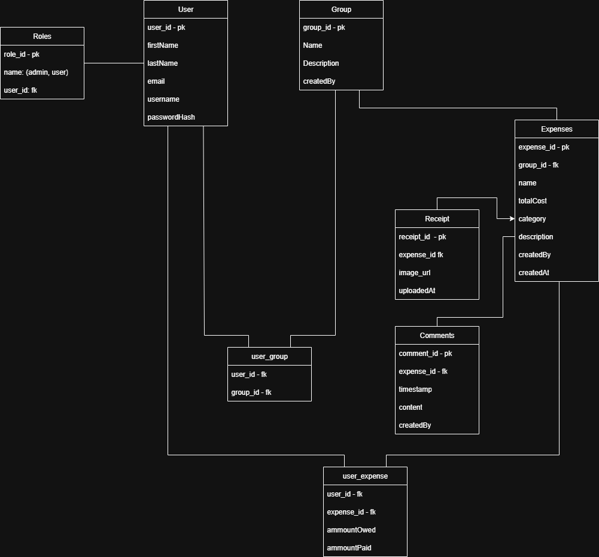

# Project Proposal: TripSplit

## Description
- TripSplit will be an app designed to simplify group trip planning by allowing users to create shared spaces where they can manage a group's budget and track shared expenses.
- Each group acts as a collaborative environment where members can view expenses, track payments, and maintain transparency in cost-sharing. 
- The app aims to remove the confusion and hassle of manual expense tracking, especially when multiple people are involved.
- Within each group, members can create, view, update, and delete expenses. Expenses can be categorized (e.g., food, transportation, lodging), and users can add details such as amount, description, who paid, and how the cost should be split among group members.
- Roles:
    - **User**:
      - Can create a group and become a group admin
      - Can join any group using a valid group ID
      - Can perform Create, Read, Update, and Delete (CRUD) operations on expenses
      - Can perform CRUD operations on comments they personally added
    - **Group Admin**:
      - Has access to all user functions
      - Can update the group’s name and description
      - Can add new users to the group
      - Can remove users from the group
    - **Moderator**:
      - Has full access to CRUD operations for Groups, Users, & Comments


## Data

### Users

- **userId** (`int`): unique identifier for the user.
- **firstName** (`String`): the user's given name.
- **lastName** (`String`): the user's family name.
- **email** (`String`, unique): the user's email for login and notifications.
- **username** (`String`, unique): display name or handle.
- **passwordHash** (`String`): hashed version of user’s password.

### Groups

- **groupId** (`int`): unique identifier for the group.
- **name** (`String`): name/title of the group.
- **description** (`String`): short summary of the trip or purpose.
- **createdBy** (`User`): reference to the User who created the group.

### Expenses

- **expenseId** (`int`): unique identifier for the expense.
- **name** (`String`): short title of the expense.
- **totalCost** (`double`): total amount of the expense.
- **category** (`String`): category type (e.g., lodging, food).
- **description** (`String`, optional): extra details.
- **createdAt** (`LocalDateTime`): timestamp of creation.
- **createdBy** (`User`): reference to the user who created the expense.
- **group** (`Group`): reference to the group this expense belongs to.

### Receipts

- **receiptId** (`int`): unique identifier for the receipt.
- **imageURL** (`String`): path to the uploaded receipt image.
- **uploadedAt** (`LocalDateTime`): timestamp of upload.
- **expense** (`Expense`): reference to the expense the receipt belongs to.

### Comments

- **commentId** (`int`): unique identifier for the comment.
- **timestamp** (`LocalDateTime`): when the comment was posted.
- **content** (`String`): comment text.
- **createdBy** (`User`): reference to the user who made the comment.
- **expense** (`Expense`): reference to the related expense.

## Validation

### Users
- **firstName** is required and cannot be blank.
- **lastName** is required and cannot be blank.
- **email** is required, must be a valid email format, and must be unique.
- **username** is required, must be unique, and must be 3–20 characters long using only letters, numbers, and underscores.
- **passwordHash** is required and must represent a valid hashed password.

### Groups
- **name** is required and must be between 3 and 50 characters.
- **description** is optional but must not exceed 255 characters.
- **createdBy** must reference an existing user and cannot be null.

### Expenses
- **name** is required and must be between 3 and 100 characters.
- **totalCost** is required, must be a positive number greater than 0.
- **category** is required and must be one of the following predefined categories: `"food"`, `"lodging"`, `"transportation"`, `"activities"`, or `"miscellaneous"`.
- **description** is optional but must not exceed 255 characters.
- **createdAt** must not be in the future.
- **group** must reference an existing group and cannot be null.
- **createdBy** must reference an existing user and cannot be null.

### Receipts
- **imageURL** is required and must be a valid URL or file path format.
- **uploadedAt** must not be in the future.
- **expense** must reference an existing expense and cannot be null.

### Comments
- **timestamp** must not be in the future.
- **content** is required and must be between 1 and 500 characters.
- **expense** must reference an existing expense and cannot be null.
- **createdBy** must reference an existing user and cannot be null.

## Database Schema



## Package/Class Overview   

```
src
├─── main
│   └─── java
│       └─── learn
│           └─── tripSplit
│               │   App.java                          -- app entry point
│               │
│               ├─── data
│               │   └─── mappers
│               │          UserMapper.java           -- maps SQL rows to User objects
│               │          GroupMapper.java          -- maps SQL rows to Group objects
│               │          ExpenseMapper.java        -- maps SQL rows to Expense objects
│               │          ReceiptMapper.java        -- maps SQL rows to Receipt objects
│               │          CommentMapper.java        -- maps SQL rows to Comment objects
│               │   
│               │   UserJdbcTemplateRepository.java     -- concrete User repository
│               │   UserRepository.java                 -- User repository interface
│               │   GroupJdbcTemplateRepository.java    -- concrete Group repository
│               │   GroupRepository.java                -- Group repository interface
│               │   ExpenseJdbcTemplateRepository.java  -- concrete Expense repository
│               │   ExpenseRepository.java              -- Expense repository interface
│               │   ReceiptJdbcTemplateRepository.java  -- concrete Receipt repository
│               │   ReceiptRepository.java              -- Receipt repository interface
│               │   CommentJdbcTemplateRepository.java  -- concrete Comment repository
│               │   CommentRepository.java              -- Comment repository interface
│
│               ├─── domain
│               │       Result.java                  -- generic result wrapper for operations
│               │       ResultType.java              -- enum for result types (SUCCESS, INVALID, etc.)
│               │       UserService.java             -- business logic for users
│               │       GroupService.java            -- business logic for groups
│               │       ExpenseService.java          -- business logic for expenses
│               │       ReceiptService.java          -- business logic for receipts
│               │       CommentService.java          -- business logic for comments
│
│               ├─── models
│               │       User.java                    -- user model
│               │       Group.java                   -- group model
│               │       Expense.java                 -- expense model
│               │       Receipt.java                 -- receipt model
│               │       UserGroup.java               -- relationship between users and groups
│               │       UserExpense.java             -- relationship between users and expenses
│
│               └─── controllers
│                       ErrorResponse.java           -- standard error message structure
│                       GlobalExceptionHandler.java  -- handles uncaught exceptions and sends proper responses
│                       UserController.java          -- controller for users
│                       GroupController.java         -- controller for groups
│                       ExpenseController.java       -- controller for expenses
│                       ReceiptController.java       -- controller for receipts
│                       UserGroupController.java     -- controller for user-group operations
│                       UserExpenseController.java   -- controller for user-expense operations
│
└─── test
    └─── java
        └─── learn
            └─── tripSplit
                ├─── data
                │       UserJdbcTemplateRepositoryTest.java     -- tests for User repository
                │       GroupJdbcTemplateRepositoryTest.java    -- tests for Group repository
                │       ExpenseJdbcTemplateRepositoryTest.java  -- tests for Expense repository
                │       ReceiptJdbcTemplateRepositoryTest.java  -- tests for Receipt repository
                │       CommentJdbcTemplateRepositoryTest.java  -- tests for Comment repository
                │
                └─── domain
                        UserServiceTest.java            -- tests for UserService
                        GroupServiceTest.java           -- tests for GroupService
                        ExpenseServiceTest.java         -- tests for ExpenseService
                        ReceiptServiceTest.java         -- tests for ReceiptService
                        CommentServiceTest.java         -- tests for CommentService
```