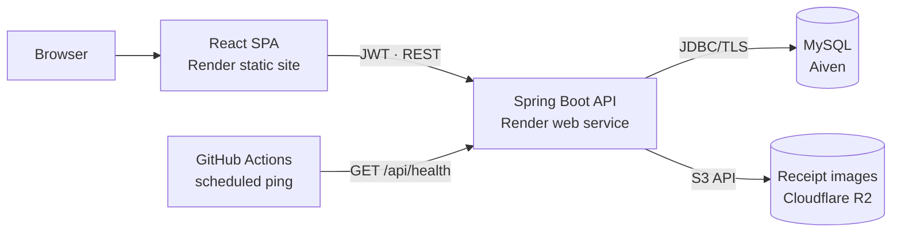

# TripSplit

A shared expense ledger for group travel. Open a trip, log what everyone spends,
and get the shortest list of payments that squares the group.

**[Live app](https://tripsplit-web.onrender.com)** · no signup needed — the landing
page has a **Try the live demo** button that loads the real interface against sample
data.

> The backend runs on a free instance that sleeps overnight. If the first request
> hangs for a minute, it is waking up.

---

## What it does

- **Groups** — one ledger per trip. Members join with a short invite code rather than
  an email invitation flow.
- **Expenses** — who paid, how much, how it splits, with a receipt image attached.
- **Settle up** — net position per person, plus the minimal set of payments that
  clears every debt. Recording a payment updates the ledger; a group whose balances
  reach zero is stamped *Settled*.
- **Activity** — a per-group feed of expenses added and payments recorded.
- **Demo mode** — the full interface backed by in-memory fixtures, so the app can be
  explored without an account. Mutating actions are refused with an explanation
  rather than opening a form that cannot submit.

## Architecture



The scheduled ping exists because both free tiers idle out: Render stops a web
service after 15 minutes without traffic, and Aiven powers off a database with no
connections. The health endpoint runs `select 1`, so a single request keeps both
awake. It is scheduled around a nightly quiet window to stay inside the free monthly
instance-hour allowance — see [DEPLOY.md](DEPLOY.md).

## Stack

| Layer | Choice |
|---|---|
| Frontend | React 19, React Router 7, Bootstrap 5, Create React App |
| Backend | Java 11, Spring Boot 2.3, Spring Security + JWT, `JdbcTemplate` |
| Database | MySQL 8 |
| Storage | Cloudflare R2 via the AWS S3 SDK |
| Hosting | Render (Docker web service + static site), Aiven |
| CI | GitHub Actions — builds both halves, runs the test suite against a MySQL service container |

## Notable decisions

**Debt simplification.** Settling naively means every debtor pays every creditor.
Instead the service reduces each member to a single net position, then greedily pairs
the largest debtor with the largest creditor, which closes any group in at most
*n − 1* payments. Sub-cent imbalances from splitting odd amounts are treated as
square so rounding crumbs never produce a one-cent transfer.
See [`SettleUpService`](server/src/main/java/learn/tripsplit/domain/SettleUpService.java).

**Invite codes over sequential IDs.** Joining a group originally took its primary
key, so any integer was a valid guess at somebody else's trip. Groups now carry an
8-character code drawn by `SecureRandom` from an alphabet with no `0/O/1/I`, checked
for collisions at generation time.

**Money is `BigDecimal` end to end.** Balances, splits, and settlements never touch
floating point. The [settle-up tests](server/src/test/java/learn/tripsplit/domain/SettleUpServiceTest.java)
assert the two invariants that matter — balances always sum to zero, and applying
every suggested payment leaves everyone at zero — alongside the rounding and
partial-payment cases.

**Demo mode reuses the real UI.** Rather than a separate marketing mock, demo mode
swaps the API layer for in-memory fixtures behind the same components, so what a
visitor explores is the actual application.

**Fitting a JVM in 512 MB.** The free instance was being OOM-killed at boot. The
container now pins `SerialGC`, caps the heap below the container limit, and bounds
metaspace, which is what keeps it inside the free tier.

## Running locally

Requires JDK 11, Maven, Node 20, and a local MySQL.

```sh
# database
mysql -u root -p < server/sql/trip-split-schema-prod.sql

# backend — http://localhost:8080
cd server
TRIP_SPLIT_DB_USERNAME=root TRIP_SPLIT_DB_PASSWORD=your_password \
  JWT_SECRET=any_long_random_string \
  mvn spring-boot:run

# frontend — http://localhost:3000
cd client/trip-split-client
npm install && npm start
```

Receipt upload stays disabled unless the R2 variables are set; everything else runs
without them.

```sh
# tests
cd server
mysql -u root -p < sql/trip-split-schema-test.sql
TRIP_SPLIT_DB_USERNAME=root TRIP_SPLIT_DB_PASSWORD=your_password mvn test
```

The settle-up suite is plain JUnit and Mockito with no Spring context, so it runs
without a database.

## Layout

```
client/trip-split-client/   React app
server/                     Spring Boot API
  src/main/java/learn/tripsplit/
    controllers/            REST endpoints
    domain/                 services, settle-up algorithm, validation
    data/                   JdbcTemplate repositories and row mappers
    security/               JWT filter, converter, Spring Security config
  sql/                      schema for production and tests
.github/workflows/          CI and the keep-alive ping
DEPLOY.md                   deployment and free-tier operations guide
```
